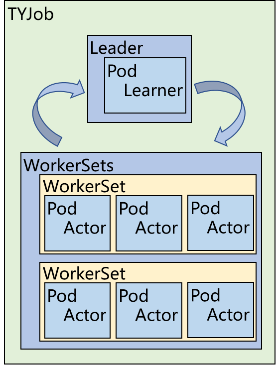
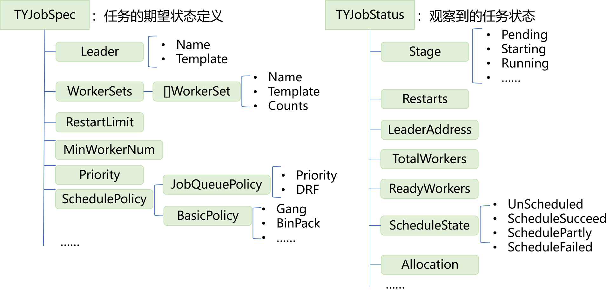
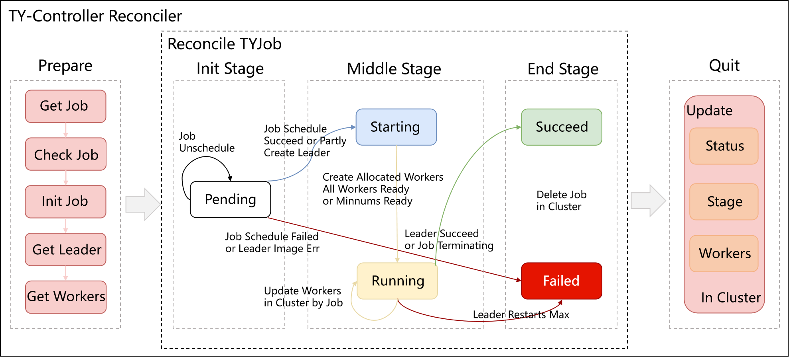
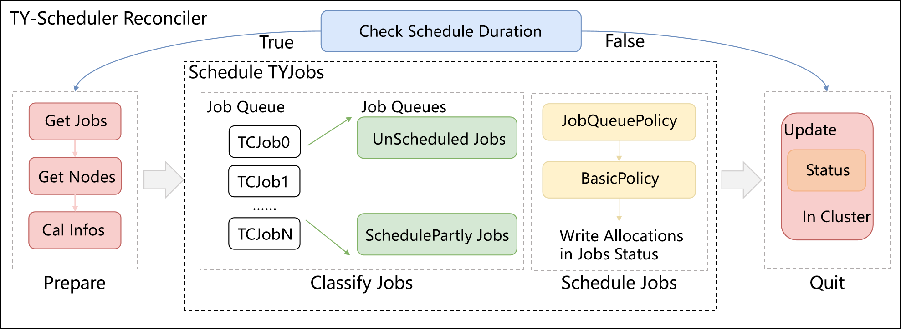
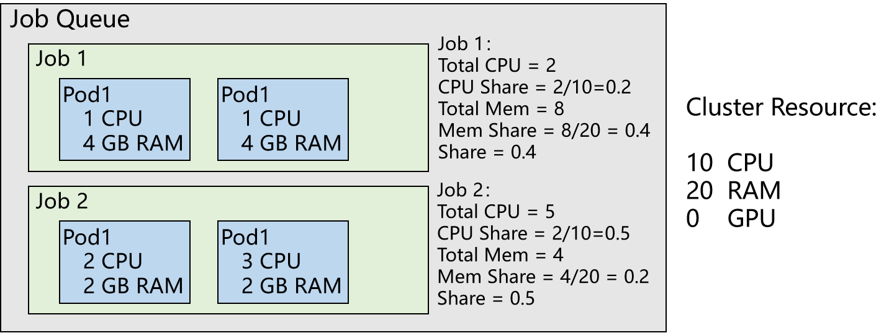

架构
====
.. image:: images/架构图.png

Arranger由Scheduler和Controller两部分组成：
 * Controller负责对CRD API资源进行合法性校验，管理CRD（TYJob）的生命周期，创建和删除资源。
 * Scheduler是一个周期性调度器，会将周期内的job依策略排序，按顺序对其中的任务进行调度，并支持多种调度算法。

API
----

Arranger针对TYRL的结构设计了自定义资源TYJob，
Leader对应TYRL中的Learner，Worker则对应Actor，WorkerSet是一类启动参数的Actor的集合。

TYJobSpec定义了任务的期望状态，各字段及其含义如下：

.. code-block:: go

    type TYJobSpec struct {
       // INSERT ADDITIONAL SPEC FIELDS - desired state of cluster
       // Important: Run "make" to regenerate code after modifying this file

       // RestartLimit defines the restart limit for Leader and WorkerSet
       // +kubebuilder:default=3
       RestartLimit int `json:"restartLimit,omitempty"`

       // Volumes defines the shared volumes for job.
       Volumes []corev1.Volume `json:"volumes,omitempty"`

       // leader defines learner and manger pod
       // +kubebuilder:validation:Required
       Leader Leader `json:"leader,omitempty"`

       //worker defines actor set
       // +kubebuilder:validation:Required
       WorkerSets []WorkerSet `json:"workerSets,omitempty"`

       // CleanPodPolicy defines the policy to clean pods after TYJob completed.
       // +kubebuilder:default=All
       // +kubebuilder:validation:Enum=Running;All;None
       CleanPodPolicy CleanPodPolicy `json:"cleanPodPolicy,omitempty"`

       // handle terminate.
       //+kubebuilder:default=false
       Terminating bool `json:"terminating,omitempty"`

       // MinWorkersNum defines the minimum num of workers to start the job
       //+kubebuilder:default=1
       MinWorkersNum int `json:"minWorkersNum,omitempty"`

       //Priority defines the priority of the job
       //+kubebuilder:default=5
       //+kubebuilder:validation:Minimum=1
       //+kubebuilder:validation:Maximum=10
       Priority int `json:"priority,omitempty"`

       SchedulerPolicy Policy `json:"schedulerPolicy,omitempty"`
    }
    type Policy struct {
       //JobQueuePolicy defines the schedule policy among jobs
       JobQueuePolicy JobQueuePolicy `json:"jobQueuePolicy,omitempty"`

       //BasicPolicy defines the schedule policy of one job
       BasicPolicy BasicPolicy `json:"basicPolicy,omitempty"`
    }
    type JobQueuePolicy string

    const (
       PriorityPolicy JobQueuePolicy = "Priority"

       DRFPolicy JobQueuePolicy = "DRF"
    )

    type BasicPolicy string

    const (
       GangPolicy BasicPolicy = "Gang"

       BinPackPolicy BasicPolicy = "BinPack"

       LeaderFirstPolicy BasicPolicy = "LeaderFirst"

       MinFragmentPolicy BasicPolicy = "MinFragment"

       JobAffinityPolicy BasicPolicy = "JobAffinity"

       JobAntiAffinity BasicPolicy = "JobAntiAffinity"
    )

    type CleanPodPolicy string

    const (
       // CleanPodPolicyRunning means deleting all running pods of the job after completed
       CleanPodPolicyRunning CleanPodPolicy = "Running"

       // CleanPodPolicyAll means deleting all pods of the job after completed
       CleanPodPolicyAll CleanPodPolicy = "All"

       // CleanPodPolicyNone means never deleting any pods of the job after completed
       CleanPodPolicyNone CleanPodPolicy = "None"
    )

    type Leader struct {
       // +kubebuilder:validation:Required
       Name string `json:"name,omitempty"`

       // Template defines the learner pod for TYJob.
       // +kubebuilder:validation:Required
       Template corev1.PodTemplateSpec `json:"template,omitempty"`
    }

    type WorkerSet struct {
       // +kubebuilder:validation:Required
       Name string `json:"name,omitempty"`

       // Template defines the actor pod for TYJob.
       // +kubebuilder:validation:Required
       Template corev1.PodTemplateSpec `json:"template,omitempty"`

       // Counts defines the number of workers in workSet.
       // +kubebuilder:default=1
       // +kubebuilder:validation:Minimum=1
       Counts int `json:"counts,omitempty"`
    }

Controller控制TYJob的生命周期，TYJob的状态Stage设计如下：

.. code-block:: go

    type Stage string

    const (
       // JobPending means the job has been submitted to the cluster,
       JobPending Stage = "Pending"

       // JobStarting means the leader has been created and waits for creating workers(writing env -> leader ip)
       JobStarting Stage = "Starting"

       // JobRunning means all the pods are in running state
       JobRunning Stage = "Running"

       // JobRescheduling means the job has been rescheduled and waits for restarting.
       JobRescheduling Stage = "Rescheduling"

       // JobSucceeded means job completed without error
       JobSucceeded Stage = "Succeeded"

       // JobFailed means some pods failed, job is also considered failed
       JobFailed Stage = "Failed"
    )

Scheduler控制TYJob的调度阶段，调度阶段设计如下：

.. code-block:: go

    type ScheduleState string

    const (
       JobUnscheduled ScheduleState = "Unscheduled"

       JobScheduledSucceed ScheduleState = "ScheduledSucceed"

       JobScheduledFailed ScheduleState = "ScheduledFailed"

       JobScheduledPartly ScheduleState = "ScheduledPartly"
    )

Controller
------------

简介
~~~~

Arranger Controller负责管理Job的生命周期即Stage，
包括Pending,Starting,Running,Succeed,Failed，
同时负责状态中Leader和Worker的创建及删除。在一次Reconciler中，
Controller获取触发Reconciler的Job对象，检查声明资源的合法性并进行初始化，
继而根据当前的Stage和调度阶段进行状态转移，最后更新Status,Stage,Workers，结束此次Reconciler

工作流
~~~~~~

Arranger Controller工作流程如下：

1. 获取用户提交的Job，检查合法性并初始化
2. 状态转移
 * TYJob初次提交时处于Pending阶段
  - 若此时的调度阶段处于UnScheduled，保持Pending状态
  - 若此时的调度阶段处于ScheduledPartly或ScheduledScuueed阶段，创建Leader，Job进入Starting状态
  - 若此时的调度阶段处于ScheduledFailed阶段，进入Failed状态
 * Starting阶段会创建所有已有调度结果的Worker，当所有或最小需要的Worker都处于Ready状态时Job进入Running状态
 * Running阶段会尝试创建未创建的Worker（若存在）
  - 当Leader Succeed或Job Terminating时，Job进入Succeed状态
  - 当Leader重启次数超过最大重启次数时，Job进入Failed状态
 * Job到达Succeed或Failed状态后会清空所有Pod资源，任务结束
3.更新Status,Stage,Workers，结束本次Reconciler

Scheduler
------------

简介
~~~~

Arranger Scheduler负责调度job和pod，
两种调度均支持多种调度策略。在一次Reconciler中，
Scheduler先判断是否到达调度周期。若到达，则准备调度需要的Jobs及Nodes信息。
Job Queue会依Job调度策略对Job进行排序，再依次处理Job中的Pod。
Job根据其中Pods的调度阶段确定本身的调度阶段，
包括Unscheduled,ScheduledSucceed,ScheduleFailed,ScheduledPartly,
Scheduler会尝试为处于后两个调度阶段的job中的未调度pod进行调度，
并将结果写入TYJob.status.Allocations中以供Controller使用。

工作流
~~~~~~

Arranger Scheduler工作流程如下：

1. 周期性地开启调度
2. 获取用户提交的Job和节点信息
3. 将Job按调度阶段分类
4. 根据JobQueuePolicy对Job Queue进行排序，再根据BasicPolicy对Job中的Pod进行调度，找到当前策略下得分最高的节点，保存该结果
5. 更新Status，结束本次Reconcile

JobQueuePolicy
~~~~~~~~~~~~~~~~~~~

Arranger支持在一个调度周期中对多job任务进行调度，
这些job会根据其中任务的调度情况打上调度阶段标签，
所有待调度Job将根据JobQueuePolicy进行排序，以下为目前支持的策略：

PriorityPolicy
#################

根据 JobQueue 中每个 Job.Spec.Priority 的值对 Queue 中所有Job排序，确定被 Scheduler 调度的先后顺序

DRFPolicy
########################

Dominant Resource Fairness，Scheduler根据Job的主导资源，计算Job的share值，在调度的过程中，具有较低share值的Job将具有更高的调度优先级

BasicPolicy
~~~~~~~~~~~~~~~~

在对单个pod进行调度时，Arranger对所有能够满足需要资源的节点按一定标准进行打分，
将pod调度到得分最高的节点上，以下为目前支持的策略：

Binpack policy
########################

目标是尽量把已有的节点填满（尽量不往空白节点分配）。具体实现上，Binpack调度算法是给可以投递的Nodes打分，分数越高表示节点的资源利用率越高，将应用负载靠拢在部分Nodes

LeaderFirst policy
########################

目标是将 Learner 调度到资源利用率较低的Node，保障Learner 的 正常运行；Actor 则调度到资源利用率较大的Node，节约部分资源。Leader GPU 权重提高，选分数低的节点，Worker CPU 权重提高，选分数高的节点

MinFragmen policy
########################

目标是减少集群节点的资源碎片率。碎片率：{ 1 - Abs[ CPU(Request / Allocatable) - Mem(Request / Allocatable)] } * Score。是用来考虑 CPU 的使用比例和内存使用比例的差值。如果这个差值越大，就表示碎片越大，Worker 优先不分配到这个节点上；如果这个差值越小，就表示这个碎片率越小，Worker优先分配到这个节点上

JobAffinity Policy
########################

目标是尽量将一个 Job 的 Pods 调度到一个节点， 集中负载

JobAntiAffinity
########################

目标是尽量将一个 Job 的 Pods 打散到不同节点，平坦负载